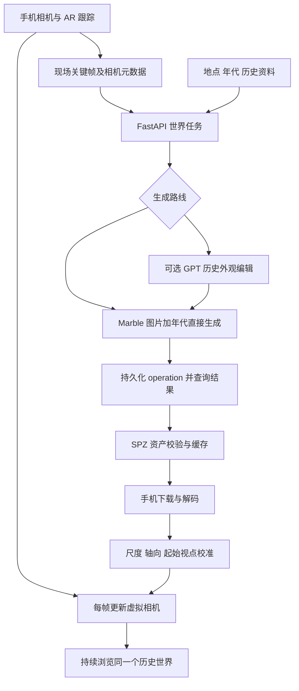

# CenturyPano：现场生成历史世界的 Marble 实施计划

日期：2026-09-12。状态：M0 单世界真实 API 探针已实施；2026-09-12 首次 Draft 普通图片生成实测约 25.6 秒，准备和下载检查合计 29.4 秒，实扣 230 credits。该样本仍保留现代元素，未通过历史化要求；三维渲染、手机 AR 与现场空间对齐仍待验证。详见 [实测工具与结果](MARBLE_PROBE.md)。

工作分支：`feat/marble-worlds`。起点：`6e81c08`，保存已有 GPT Image 编辑接入；其此前 82 项测试通过不代表 Marble 或手机 AR 已通过验收。

## 1. 产品目标与本次决定

用户不需要事先为地点准备模型。用户在现场打开 App、选择年代，系统根据当前环境按需生成历史世界；手机转身、俯仰、前进和侧移，持续改变同一个世界中的视角。iPhone 和 Android 都是目标平台。

采用“现场采集 → 按需世界生成 → 手机持续空间跟踪与本地渲染”的架构。现有全景应用作为生成入口、预览和回放基础，不把预制景点或照片站点跳转作为最终产品。

首选验证 `marble-1.0-draft` 的首次体验，质量基准为 `marble-1.1`；显式填写模型名。先测试“现场单图＋年代文字直接生成”，GPT Image 历史编辑作为独立对照路线，不强制串联两次生成。正式三维表示优先使用 SPZ Gaussian splats；首帧不等待额外高质量网格导出。[Marble 输入示例](https://docs.worldlabs.ai/api/world-generation-examples)、[模型说明](https://docs.worldlabs.ai/api/models)

必须区分三项承诺：

- 可以到事先没有建模的地点尝试生成；成功率、覆盖范围和现场采集质量需要实测。
- 已生成世界可以连续渲染，但要先完成手机坐标对齐与性能验证。
- 任意地点首次秒开、无限沿街延伸、准确恢复任意历史年份，目前都没有已验证的实现依据。有限场景的生成不等于无限世界扩展。

没有历史证据的建筑外观、被遮挡区域和已拆建筑标为“想象重建”，不因提供了年份就称其为历史事实。

## 2. 五分钟能否有效缩短

### 2.1 已核实的时间信息

Marble 产品指南列出的估计是：单图或文字生成全景约 30 秒，多图或视频生成全景约 2 分钟，Draft 约 20 秒，完整世界约 5 分钟。API 快速入门也给出约 5 分钟的世界生成描述。这些是官方估计，不是我们的实测值，也不是端到端 API P95 保证；阶段包含关系不够明确，不能机械相加后作为 SLA。[产品时间说明](https://docs.worldlabs.ai/)、[API 快速入门](https://docs.worldlabs.ai/api)

因此，五分钟不是所有模式的统一下限。Draft 是最值得验证的实际提速手段，但目前只能提出“争取把首次可行走等待降到约一分钟量级”的实验目标，不能承诺已经解决。

### 2.2 优化分别影响什么

| 手段 | 实际收益 | 不能据此承诺 |
|---|---|---|
| 首次使用 Draft | 尝试缩短世界计算阶段 | 正式质量、精确街道几何或端到端 20 秒 |
| 单图＋年代直接交给 Marble | 避免必经一次 GPT 编辑；由 Marble 生成全景和世界 | 年代要求一定生效、原建筑一定保持 |
| 输入有效的完整历史球形全景 | 跳过图片到全景的生成步骤 | 跳过三维计算；全景获取和历史编辑零耗时 |
| 世界完成后先加载最小可用 SPZ（如返回 100k） | 降低下载、解码和首帧负担 | 云端生成更快；所有模型都返回同一规格 |
| 不请求首屏 HQ mesh 导出 | 避免额外导出任务进入关键路径 | 碰撞网格就是带纹理的历史场景 |
| 重复请求去重、命中世界资产缓存 | 避免已完成内容重新生成 | 所有陌生地点首次都能命中；无需重新定位 |
| 保留相机与已有历史预览 | 用户看得到进度和当前环境 | 等待阶段已经支持历史三维行走 |

API 对普通照片先做全景生成；有效的 360° 等距柱状全景可跳过该阶段。横向手机全景、裁剪带、普通 2:1 图片不自动等于完整球形全景。现有 pipeline 的中间带裁剪、固定 1024 高度及条带拼接不能直接用于这个入口。[请求示例与全景判断](https://docs.worldlabs.ai/api/world-generation-examples)

**关键假设：现代完整全景＋年代文字，是否会被历史化？** 文档将文字描述为引导，并没有保证在跳过全景生成后重绘输入全景。不得为了提速把现代图原样三维化，再声称生成了过去。预先用 GPT 编辑历史全景时，要检查地平线、首尾接缝、极区与投影，并把 GPT 耗时算入总等待。

Draft 与标准世界按两个独立结果处理。未确认保留同一世界几何的原地升级 API，因此不能承诺后台生成标准世界后无跳变替换 Draft。只有验证两者对齐及几何兼容，才设计切换；否则由用户显式打开另一版本。

### 2.3 必做的速度与质量实验

先用一个真实生成世界通过 M0 的资产加载与初始空间对齐探针，再做下面六个组合，每格 3 次初筛，使用一致的场景、年代、输入尺寸和记录方式。所有结果初始为空，不写预期成绩充当实测。

| 输入路线 | Draft | Marble 1.1 | 主要问题 |
|---|---|---|---|
| A：现场普通照片＋年代描述 | 待测 | 待测 | 最短直接路线能否保持地点并改变年代 |
| B：现代完整球形全景＋年代描述 | 待测 | 待测 | 跳过全景阶段后，历史要求是否仍有效 |
| C：GPT 编辑后的完整历史全景 | 待测 | 待测 | 外观控制收益能否抵消额外编辑等待 |

完整球形全景不足时，B/C 先采用自有或有明确许可的测试素材；不能强标普通手机全景来填满实验表。多图作为空间质量对照，不默认视为更快。供应商未公开的种子或相机参数不自行添加。

记录这些时间点：点击生成、输入准备完成、历史编辑完成、上传完成、生成 POST 被接受、operation 完成、资产下载完成、首个可交互三维帧、手机对齐完成。供应商没有披露排队与计算分段时，合并为“供应商等待”。

同时记录失败率、费用、资产字节数、帧时间、年代符合度、地标布局、侧移视差、遮挡破洞及转回原方向的一致性。初筛只报样本值与范围；选中路线后，在实验预算内扩大样本，才报告有样本量说明的 P50/P95。

内部首轮目标（待验证）：冷启动可行走首帧 P50 ≤ 60 秒；尾延迟与对齐时间分别报告。M1 如果仅在查看器完成渲染，只记录“viewer 首帧”，直到真实空间对齐完成才能记录“可行走首帧”。若实测仍需几分钟，就如实把“生成后进入”写进产品状态，不能通过先显示二维图掩盖三维未就绪。

## 3. Google 街景能否作为世界模型输入

### 3.1 技术上可以供图，但不是 Google 帮我们重建

Marble 接受图片、完整球形全景、多图等输入。若已获得适用许可，可以把街景图像交给它生成世界。Static API 返回指定方向视图；Tiles 可提供全景瓦片和方向等 metadata。二者都不把 GPT 图片转换成三维场景。[Street View Tiles](https://developers.google.com/maps/documentation/tile/streetview)、[Static 请求](https://developers.google.com/maps/documentation/streetview/request-streetview)

技术路线应固定同一个 pano ID 和拍摄位置，避免把不同位置的图片当作同一中心的全景；依据 metadata 处理方向、投影和图片尺寸。没有图像时直接报告缺失，不把占位图送给模型。Google 的方向信息与 Marble 的相对 `azimuth` 需要转换验证，不能假定模型理解全球坐标或真实相机外参。

Google 输入可能减少用户扫描的负担、提高起始覆盖，也可能与用户当前视点、季节或建筑状态不同。它不会直接消除 Marble 的三维计算时间；多视图输入还可能增加全景准备阶段。

### 3.2 标准接口与专门生成授权要分开

| 数据路线 | 本计划如何处理 |
|---|---|
| 用户现场自摄原图 | 主实现路线；输入来源可追溯，无须预建地点 |
| 直接获得第三方生成和结果保存许可的全景 | 第二种输入来源，保存许可范围与原始素材标识 |
| 普通 Google Street View Tiles／Static → Marble | 不作为默认可用路线；标准显示权限不足以覆盖外部生成和缓存 |
| Google Maps Imagery Grounding | 官方标注 Private Preview，探索准入及具体合同；不放进比赛关键路径 |
| Google Project Genie 的 Street View 功能 | 可研究体验；尚未确认可直接接入本 App 的公开 API |

本次审阅的非 EEA 标准条款 §3.2.3(a)–(c) 涉及导出、缓存和基于 Maps 内容生成新内容；它并不只是限制训练模型。Map Tiles 政策还明确限制图像分析、机器解释等非可视化用途。实际适用条款随账单地址与合同而定。[Maps 条款](https://cloud.google.com/maps-platform/terms)、[Tiles 政策](https://developers.google.com/maps/documentation/tile/policies)

另一方面，Google 确有专门的生成路线：开发者产品页列出 Maps Imagery Grounding Private Preview，Project Genie 已公开介绍结合美国地点 Street View 生成可探索世界。因此不能笼统说 Google 街景不能和 AI 结合。尚需确认的是：我们能否获得权限、素材或结果能否交给 Marble、可保存多久、能否导出及如何署名。公开产品介绍没有回答这些第三方交付条款。[Grounding 产品页](https://mapsplatform.google.com/maps-products/grounding/)、[Project Genie 公告](https://blog.google/innovation-and-ai/models-and-research/google-deepmind/project-genie-expands/)

预留 `google_grounded` 来源接口，但未确认准入和上述许可前保持不可用。Google 托管的用户贡献照片不自动等于我们的自有素材；自有照片优先读取自己保留的原文件。无需等待 Google 准入即可开展主线实验。

## 4. 系统结构

生成期间继续显示相机和明确的任务状态。已有应用侧历史图片可作预览，但不得假定 Marble operation 中途一定提供可下载的三维资产或全景。三维就绪、资源解码完成、AR 跟踪正常、空间对齐完成是不同条件。

## 5. 后端实施

现有 `/jobs` 保留全景契约。新增独立世界任务，复用私有上传校验、原子 manifest 写入、历史提示词与资料处理能力、OpenAI 编辑器及文件分发方式。现有约束函数只支持四个年代及固定代表年，不能直接接收任意年份；世界流程另建年份适配与支持范围校验，以用户目标年构建上下文，不静默映射到 1925 等代表年。

| 建议文件 | 职责 |
|---|---|
| `app/worlds/marble.py` | 官方生成、operation 查询、世界查询适配器 |
| `app/capture.py` | 关键帧、内参、方向、位姿与来源校验 |
| `app/history_context.py` | 目标年份校验、历史资料与来源、提示词年份适配 |
| `app/world_pipeline.py` | 直接／历史编辑路线、持久任务恢复、资产处理 |
| `app/world_manifest.py` | 独立世界 schema 与状态转换 |
| `app/world_cache.py` | 请求去重、资产缓存、地点候选检索 |
| `app/world_assets.py` | SPZ／GLB 下载、校验、访问控制及分发 |
| `scripts/probe_marble.py` | 单次真实调用和耗时、费用报告 |
| `web/world/` | SPZ 调试查看器与生成状态页面 |
| `mobile/` | 选定的 iOS／Android 采集、跟踪与渲染客户端 |

建议 API：

- `POST /captures`：上传关键帧与相机信息，返回 capture ID。
- `POST /world-jobs`：提交 capture ID、目标年、生成模式及应用层请求 ID，立即返回任务 ID。
- `GET /world-jobs/{id}/manifest`：返回可公开任务状态和已验证资产描述。
- `GET /world-jobs/{id}/assets/{name}`：按允许的文件名提供私有世界资产。
- 本次会话的空间对齐保存在客户端；如需诊断上传，单独记录 session ID，不覆盖可复用世界本身。

服务端保存来源证明、输入哈希、用户目标年 `requested_year`、实际提示词年份 `effective_year`、历史依据、冻结提示词版本、图片模型／画质、Marble 模型／参数、operation ID、world ID、资产校验和、尺度元数据与各阶段时间戳。默认两个年份一致；不支持的年份明确返回错误，近似年代模式必须另行明示。密钥只留服务端；第三方临时签名 URL 不作为我们永久缓存地址。

任务状态至少包括 `queued`、`preparing_input`、`history_editing`、`submitting`、`generating`、`fetching_assets`、`validating`、`ready`、`submission_unknown`、`error`。客户端另有 downloading／decoded／renderable、tracking／limited／lost，以及 alignment unverified／calibrated。

收到生成成功响应后立即持久化 operation ID，重启后继续 GET 查询已接受任务。不要沿用旧全景任务“服务重启一律失败”的策略，也不要用一个几分钟长的前端 HTTP 请求等待所有步骤。只有 `done:true` 且不存在 operation error 才进入资产阶段。[operation 接口](https://docs.worldlabs.ai/api/reference/operations/get)

针对重复点击采用应用层去重。生成 POST 已发送但结果不明时进入 `submission_unknown`，不盲目再次提交以免重复付费。当前未确认供应商的幂等键、远端取消或原地升级契约；应用侧放弃等待不等于远端已取消或不会计费。429 按官方 `Retry-After` 与退避处理；已接受任务继续轮询，避免重生成。[限流说明](https://docs.worldlabs.ai/api/rate-limits)

## 6. 现场采集与物理移动

每张关键帧保存：图像哈希、时间戳、内参 K、尺寸和方向、米制相机位姿、跟踪质量。裁剪、旋转或缩放图片时同步转换内参。GPS 及精度作为地点上下文，手机步行位姿来自 AR 跟踪。

先用单图路线测最短等待；短扫描、多视角和可用深度用于后续空间质量实验。只把 Marble 官方支持的方向字段发送给模型；完整外参保留在我们自己的对齐流程中，不假定模型已接收或遵守这些约束。

Marble 给出的 `metric_scale_factor` 和 `ground_plane_offset` 用于生成资产的米制转换与地面对齐，之后还需处理引擎坐标轴。它们不能单独证明生成建筑与现实街道测量一致。对 splat 中心和大小应用缩放的方式必须正确，不能重复缩放或误把偏移应用到大小。[坐标说明](https://docs.worldlabs.ai/api/rendering-spz)

手机实际使用的关系是“本次 AR 会话到生成世界的变换＋实时相机位姿”。校准需验证起始相机、尺度、地平面、朝向和可匹配地标。初期允许现场辅助校准用于找出误差；最终一键体验要求自动校准通过同样验收，不能把辅助操作长期隐藏起来。

M0 专门验证一个真实生成世界能否对应回源相机：先调查返回数据是否提供足够的起始视点信息；否则尝试在原始关键帧与生成资产渲染视图间匹配地标，结合可用几何／深度建立坐标对应。记录哪些信息可自动求解、哪些依赖人工。图像方位、估计米制尺度或桌面查看器成功都不足以证明配准成立；如果无法稳定自动对齐，这是一键现场体验的硬缺口，应在扩展速度实验前暴露。

生成器可能改变原街道几何，未见区域是推测内容。真实人走一米，应对应场景中正确的一米位移；重新回到原位置应看到同一世界。达不到对齐条件时不显示“可实走”状态。虚拟碰撞网格也不代表现实行人、车辆和障碍物；遮挡与真实环境提示需要独立处理。

## 7. 双端客户端与 Unity 决策

Unity 不是 Marble 的前提。第一步用 Three.js＋Spark 做资产查看和性能基线，官方已有这类浏览器示例；键盘、触屏或陀螺仪操作仅验证渲染，不算物理步行 AR 通过。[交互示例](https://docs.worldlabs.ai/api/interactive-world-examples)

手机客户端首选验证 Unity＋AR Foundation，共用 AR 会话、相机和交互逻辑，分别部署 ARKit／ARCore。**前置条件是目标两台手机上存在可用且性能足够的 SPZ／splat 渲染路径**；AR Foundation 本身不负责解码 SPZ。[Unity 文档](https://docs.unity3d.com/Packages/com.unity.xr.arfoundation@6.0/manual/index.html)

如果团队已有原生经验，或 Unity splat 路径不通过，用 Swift ARKit 与 Kotlin ARCore 壳桥接共享查看器作为替代候选。桥接需要传输同一约定的 pose、projection、viewport、时间戳及 tracking state，并测试 WebView 帧率与相机同步。两条实现路线只选一条进入正式开发，不同时维护两套。

在客户端选型验证前，不将“必须 Unity”写入后端接口。无论引擎如何，生成世界、原始素材和相机契约保持独立。

## 8. 缓存、版本与扩展边界

缓存分为两级：生成前的 `request_key` 覆盖有序原图哈希、有效相机信息摘要、用户目标年与实际提示词年份、资料版本、提示词版本、图像模型／画质、Marble 模型／参数及 schema 版本，直接指向已冻结的世界任务。生成后的 `resolved_asset_key` 再加入实际历史编辑图哈希和资产校验和。这样在途去重和缓存查询可以发生在 GPT／Marble 调用之前；不能为了计算命中键先重新生成历史图片。

经纬度或 geohash 只检索候选世界，不直接当命中证明：同一格可能有不同楼、楼层、拍摄方向和定位误差。跨会话复用资产后，必须重新定位，不能复制上一位用户的 AR 变换。公共复用与个人素材隔离也要分开，不能把私人上传自动变成公共街区库。

固定每次会话的世界版本。M0 先核实 Draft 实际返回的可用 SPZ 规格和碰撞资产，不能预设 `100k` 或其他字段必定存在。选择最小的可用且受支持资产，缺少可渲染资产时明确失败；缺少碰撞资产时不声称具备碰撞功能。后续升级同一世界更高密度资产时，也需核对坐标一致性。Draft 到标准模型不算同一世界的普通 LOD 切换。[资产 schema](https://docs.worldlabs.ai/api/reference/openapi)

Marble 网页产品有扩展与组合功能，不等于已存在可调用的连续扩展 API。未确认公开服务契约前，先用有明确有效边界的局部世界；边界由内容质量验收定义，不能仅由文件包围盒推断。连续沿街扩展保留为研发项：新观测、重叠约束、旧建筑固定、全局坐标一致和接入策略都要验证。[产品功能与时间说明](https://docs.worldlabs.ai/)

## 9. 费用与资源计划

官方 API 积分与 Marble 网页订阅分开。当前标准换算为 1 美元／1,250 积分：Draft 的完整 pano 输入为 150 积分，普通单图输入合计 230；1.1 对应 1,500 和 1,580。约为每次 $0.12／$0.184 与 $1.20／$1.264，未计入 GPT、传输等其他成本；价格以调用时账户为准。[API 价格](https://docs.worldlabs.ai/api/pricing)

18 次初筛按上述三个输入路线各自配对约需 15,330 Marble 积分（约 $12.26），这是计划预算、不是已支出。GPT 编辑、额外输入变体、重跑和质量导出另算。先设置实验次数和应用层预算上限，再执行真实探针；不把预付余额视作应用的硬限额。

初始只发起低并发世界任务，遵守账户级限流；世界生成不能复用当前图片瓦片的“每任务六路调用”设置。资产服务限制存储体积、提供删除机制；移动端先测试低密度资产的显存、发热和持续帧率。

## 10. 实施里程碑与四人分工

这些是按依赖组织的工作包，不是尚未验证情况下的小时数承诺。

| 里程碑 | 工作内容 | 放行条件 |
|---|---|---|
| M0：并行能力探针与对齐关卡 | Marble 真实单次生成与计时，探测返回资产；双端固定测试资产实走；随后用该真实世界对齐源相机 | operation 可恢复、实际 SPZ 可读；两端跟踪可用；明确真实世界自动／辅助对齐方法及误差 |
| M1：选择首次生成路线 | 六组合速度与质量初筛；确定客户端路径 | 有真实数据支持 Draft／输入选择；没有用现代表面冒充历史结果 |
| M2：服务闭环 | 世界任务状态机、上传、缓存、资产分发和 Web 诊断查看器 | 重启可恢复、重复点击不重付费、错误不伪装成功 |
| M3：现场端到端 | 采集、尺度与坐标校准、下载和手机跟踪联通 | 任意新测试地点现场生成，在两端连续实走并能恢复跟踪 |
| M4：稳态体验 | 首屏优化、资源分级、模型版本、历史证据与现实遮挡 | 延迟、质量、设备性能有记录；无跳变和状态混淆 |
| M5：扩大空间 | 新区域生成与已有世界拼接、自动重定位 | 确认所需 API 或自研路径，验证旧区域不漂移；此前不承诺无限街道 |

四个人的初始分工：

| 人员 | 主责 | 可独立推进的产物 |
|---|---|---|
| A | Marble 后端、任务恢复、去重与缓存 | 真实探针、世界 manifest、资产 API |
| B | SPZ 查看、坐标转换、移动端渲染性能 | 共享测试资产、坐标约定、Unity splat 验证 |
| C | iPhone 采集、AR 跟踪、打包与实机验证 | 相机信息、位姿流、iOS 校准报告 |
| D | Android 采集、AR 跟踪、打包与实机验证 | 同一协议的 Android 结果及交叉测试 |

选定 Unity 后，B/C/D 在同一客户端中按渲染与平台能力分工；选定原生桥接后，B 维护共享查看器，C/D 各自维护平台壳。

## 11. 验收与主要失败模式

| 风险 | 验证及处理 |
|---|---|
| Draft 快但不可用 | 同时评估年代、地标、破洞与视差；不能只按秒数选模型 |
| 年份提示不起作用 | 对照直接输入与历史预编辑；保存输入／输出供人工检查 |
| 未知方向生成内容前后矛盾 | 左右／前后移动，再回原位看同一窗与道路；记录有效范围 |
| 生成世界与现实尺度不一致 | 用已知距离或现场特征验证；未校准时保持 unverified |
| 手机帧率差、发热、崩溃 | 对实际返回的不同密度规格分别测，目标帧时间 P95 ≤ 33ms，记录设备与持续运行情况 |
| 跟踪丢失或 App 切后台 | 明确状态并重新定位，不能继续沿用漂移位姿 |
| 任务提交不确定或进程重启 | operation 持久化与恢复；禁止盲目重复 POST |
| 缓存错地点／错年代 | 候选检索与严格命中分开，保存来源和版本证明 |
| 模型生成的街道被当作史实 | 保存依据和不确定性，明确想象重建标签 |
| Google 生成权限无法获得 | 自摄主线继续推进；专门授权作为独立探索项 |
| 无限扩展契约缺失 | 有效边界明确可见；不把网页产品的按钮当可调用 API |

最低真实移动验收：前后、左右各移动约一米并抬头低头；视差方向正确；返回起点世界保持一致；原地转一圈后地标不变；跟踪丢失后能恢复；资产已下载后本地转动与走动不再依赖每帧云端请求。两台手机分别记录，不用桌面浏览器代替。

本轮只完成分支与计划。后续实际开发首先执行 M0/M1，获得 Marble API 凭证、两台目标真机以及自有测试图像后才能验证真实等待与移动体验。不能将模拟测试通过、网页可拖拽或官方演示帧率写成本产品的现场性能。
